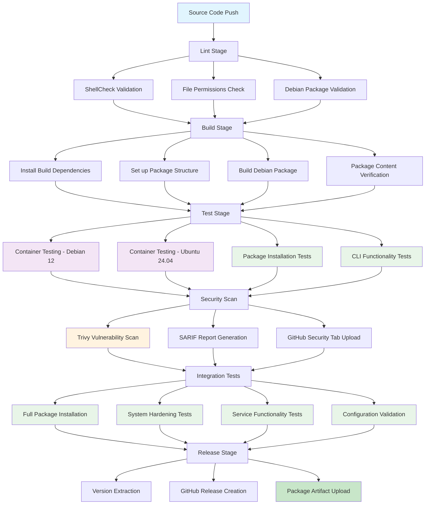

# HARDN-XDR

<p align="center">
  
</p>

<p align="center">
The Linux Security Project for Debian Systems
</p>

## Overview

HARDN is an endpoint security and hardening solution for Debian-based systems that provides:

- **System Hardening**: Comprehensive security hardening following STIG compliance guidelines
- **Endpoint Management**: Advanced monitoring, securing, and maintenance of network devices
- **STIG Compliance**: Alignment with [Security Technical Information Guides](https://public.cyber.mil/stigs/) from the [DOD Cyber Exchange](https://public.cyber.mil/)
- **Automated Security**: Real-time threat detection and response capabilities

## Features

- **Comprehensive Monitoring**: Real-time insights into endpoint performance and security status
- **Enhanced Security**: Advanced security protocols and hardening measures
- **Scalability**: Supports small to large-scale network deployments  
- **STIG Compliance**: Government-grade security for Debian-based information systems
- **Modular Architecture**: Professional CLI interface with specialized security modules
- **REST API**: HTTP API for integration and remote monitoring


## Installation

### Requirements

- **Debian 12** or **Ubuntu 24.04** (bare-metal or virtual machines)
- Root or sudo access for installation
- Internet connection for package downloads

### Installation Methods

#### 1. Debian Package (Recommended)

Download and install the latest .deb package:

```bash
git clone https://github.com/Security-International-Group/HARDN-XDR.git
cd HARDN
dpkg-buildpackage -us -uc -b
sudo dpkg -i ../hardn_*.deb
```

### What Gets Installed

HARDN-XDR provides a comprehensive security hardening suite:

- **Headless Operation**: Full compatibility with VM and desktop deployments
- **STIG Compliance**: Government-grade security hardening for Debian systems
- **Automated Security**: Real-time threat detection and response capabilities
- **Modular Architecture**: Professional CLI with specialized security modules
- **REST API**: HTTP API for remote monitoring and integration
- **Package Management**: Native `.deb` package with proper dependency management
- **System Integration**: Systemd service support and FHS-compliant structure
- **Comprehensive Logging**: Centralized logging with rotation and monitoring

Key security features:
- Malware detection and signature-based response system
- Advanced monitoring and reporting tools
- System hardening following security best practices
- Automated security updates and maintenance

For detailed information, see the [Documentation Library](docs/library/README.md) and [HARDN System Specifications](docs/HARDN.md).

## Documentation

HARDN-XDR includes comprehensive documentation organized in a structured library:

### [Documentation Library](docs/library/README.md)
All comprehensive documentation is organized in the `/docs/library/` directory:

#### [Installation & Setup](docs/library/installation/)
- **[Installation Guide](docs/library/installation/install.md)** - Complete installation instructions for all deployment scenarios

#### [Usage & Operation](docs/library/usage/)  
- **[Usage Guide](docs/library/usage/usage.md)** - Comprehensive guide for headless and interactive operation modes

#### [Security & Compliance](docs/library/security/)
- **[Lynis Compliance](docs/library/security/lynis-compliance.md)** - Automated compliance testing and scoring
- **[Security Tools](docs/library/security/hardn-security-tools.md)** - Comprehensive security tool integration reference

#### [Development & Architecture](docs/library/development/)
- **[Refactoring Summary](docs/library/development/refactoring-summary.md)** - Complete v2.0.0 transformation documentation

#### [Reference Materials](docs/library/reference/)
- **[HARDN System Specifications](docs/library/reference/HARDN.md)** - Detailed system specifications and package details
- **[DOD Cyber Exchange](docs/library/reference/DOD_CYBER_EXCHANGE.md)** - STIG compliance reference materials

### Core Documentation Files
- **[README](docs/README.md)** - Documentation overview and navigation
- **[Table of Contents](docs/TABLE_OF_CONTENTS.md)** - Complete documentation index
- **[Changelog](docs/changelog.md)** - Version history and changes
- **[Code of Conduct](docs/CODE_OF_CONDUCT.md)** - Community guidelines

## Architecture

HARDN-XDR follows a modular architecture with proper Linux filesystem hierarchy compliance:

### Installation Structure
```
/usr/bin/hardn                    # Main executable
/usr/share/hardn/modules/         # Security modules
/usr/share/hardn/templates/       # Configuration templates  
/usr/share/man/man1/hardn.1       # Manual page
/etc/hardn/hardn.conf             # System configuration
/var/log/hardn/                   # Application logs
/var/lib/hardn/                   # Application data
/lib/systemd/system/             
```

### Core Modules
- **logging.sh** - Centralized logging with rotation
- **utils.sh** - Common utilities and system checks
- **hardening.sh** - Core security hardening and STIG implementation
- **audit.sh** - Security scanning and compliance checking
- **status.sh** - System monitoring and performance metrics
- **backup.sh** - Configuration backup and restore
- **monitor.sh** - Service management and real-time monitoring
- **update.sh** - Security updates and signature maintenance
- **uninstall.sh** - Clean removal and system restoration

### Source Repository Structure
```
HARDN/
├── docs/                           # Documentation
│   ├── library/                    # Organized documentation library
│   │   ├── installation/           # Installation guides
│   │   ├── usage/                  # Usage documentation  
│   │   ├── security/               # Security & compliance docs
│   │   ├── development/            # Development & architecture
│   │   └── reference/              # Reference materials
│   ├── assets/                     # Images and diagrams
│   ├── README.md                   # Documentation overview
│   ├── TABLE_OF_CONTENTS.md        # Complete documentation index
│   ├── HARDN.md                    # System specifications
│   └── changelog.md                # Version history
├── debian/                         # Debian packaging
├── src/                           # Source code
├── systemd/                       # Service files
├── usr/                          # Installation files
├── install.sh                    # Quick install script
├── progs.csv                     # Package dependencies
└── README.md                     # This file
```

## Build Process

> **For detailed build documentation, see [docs/build-process.md](docs/build-process.md)**  
> **Quick Answer**: Docker files are NOT needed for dpkg build - they're only used for testing.

HARDN uses a CI/CD pipeline with testing and quality assurance:



### Build Stages Explained

1. **Lint Stage**: Code quality validation using ShellCheck, file permission verification, and Debian packaging structure validation
2. **Build Stage**: Debian package compilation with proper dependency management and FHS compliance
3. **Test Stage**: Multi-distribution testing in containerized environments (Debian 12, Ubuntu 24.04)
4. **Security Scan**: Vulnerability assessment using Trivy with automated security reporting
5. **Integration Tests**: End-to-end functionality testing with real system installation
6. **Release Stage**: Automated GitHub releases with versioned artifacts for production deployment

## Usage

### Command Line Interface

HARDN-XDR supports fully headless operation:

```bash
# System hardening (headless mode)
sudo hardn setup --non-interactive

# Check system status  
hardn status

# Run security audit
hardn audit

# Monitor services
hardn monitor start

# View help and version
hardn --help
hardn --version
```

### Advanced Usage

```bash
# Backup current configuration
hardn backup create

# Restore from backup
hardn backup restore

# Update security signatures
hardn update

# Clean uninstall
hardn uninstall
```

### REST API

Start the HTTP API server for remote monitoring and integration:

```bash
# Start API server on localhost:8080
hardn api

# Start on custom port with full privileges
sudo hardn api --port 9090 --host 0.0.0.0
```

API endpoints:
- `GET /api/status` - System status information
- `GET /api/services` - Security services status
- `GET /api/metrics` - Live system metrics
- `GET /api/logs` - Security logs
- `POST /api/service` - Control services

## Quick Documentation Links

### Getting Started
- [Installation Guide](docs/library/installation/install.md) - Step-by-step installation
- [Usage Guide](docs/library/usage/usage.md) - Operating HARDN in headless and interactive modes
- [Documentation Library](docs/library/README.md) - Complete documentation index

### Administration
- [System Specifications](docs/HARDN.md) - Complete package and configuration details
- [Security Tools Reference](docs/library/security/hardn-security-tools.md) - Integrated security tools
- [Compliance Testing](docs/library/security/lynis-compliance.md) - Automated compliance validation

### Development
- [System Architecture](docs/library/development/refactoring-summary.md) - Complete v2.0.0 architecture documentation
- [Code of Conduct](docs/CODE_OF_CONDUCT.md) - Contributing guidelines
- [Changelog](docs/changelog.md) - Version history and release notes

## License

This project is licensed under the MIT License.

## Contact

For questions or support, contact: office@cybersynapse.ro

## Project Partners

<p align="center">
  
</p>
